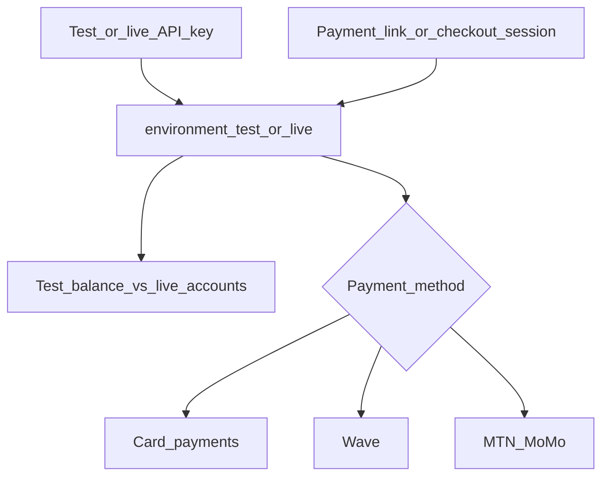

import { Tabs, Tab } from 'fumadocs-ui/components/tabs';
import { Callout } from 'fumadocs-ui/components/callout';

The lomi. **test environment** lets you run full payment flows—hosted checkout, embedded card forms, and mobile money—without moving real money or touching live balances. This page is the single reference for **simulating payments**: which test card numbers to use, how Wave and MTN MoMo behave in test mode, and what to expect in your dashboard and webhooks.

For API keys, base URLs, and rate limits, see **[Authentication](/reference/setup/authentication)**. For your first authenticated request, see **[API integration](/reference/setup/integration)**.

<Callout type="warn">
  Test transactions never affect live balances, treasury, or payouts. Customer receipt emails and WhatsApp messages are not sent in test mode.
</Callout>

## Test environment at a glance

| | Test | Live |
| --- | --- | --- |
| **API base URL** | `https://sandbox.api.lomi.africa` | `https://api.lomi.africa` |
| **Secret key** | `lomi_sk_test_…` | `lomi_sk_live_…` |
| **Publishable key** | `lomi_pk_test_…` | `lomi_pk_live_…` |
| **Balances** | Dashboard **test balance** only | Real merchant balance |
| **Responses** | `"environment": "test"` on resources | `"environment": "live"` |

Environment is determined by your **API key**, not the hostname: a test key always creates and reads test data, even if you call the production API host by mistake (the key still scopes you to test).

## How test mode is chosen



**REST API**

Every request authenticated with a test secret key runs in test mode. Created checkout sessions, payment intents, payment links, and transactions include `"environment": "test"`.

**Hosted checkout**

The environment on the **payment link** or **checkout session** controls the ledger and card form mode. Create links and sessions in **Test** mode in the [dashboard](https://lomi.africa/portal) so customers stay in the sandbox.

**Dashboard**

Toggle **Test / Live** in the portal. Payment links, QR codes, and catalog items created in test mode only appear in test reporting and test balances.

## Test balances and side effects

When a test transaction reaches **`completed`**:

- Your **test balance** increases (internal test ledger), not your live withdrawable balance.
- Platform treasury and live channel floats are **not** updated.
- Transaction metadata may include flags indicating a test ledger credit.

Customer **emails** and **WhatsApp** notifications are skipped for test transactions.

For how live balances work after completion, see **[Balance and settlement](/reference/platform/balance-and-settlement)**.

## Testing card payments

Sandbox card payments use **test card numbers** that mimic real issuer behavior—approvals, declines, and authentication challenges—without charging anyone. Use them only with test API keys and test checkout sessions.

<Callout type="info">
  Never enter real card details in test mode, and never use test numbers in production. Real cards in test are prohibited; test numbers in live will not work.
</Callout>

### How card payments complete in test

| Flow | What you do | What lomi. does |
| --- | --- | --- |
| **Hosted checkout** | Open a test checkout URL → **Card** → enter a test number | Creates a **pending** transaction, then **completed** + test balance credit after successful card confirmation |
| **Payment Intents API** | `POST /payment-intents` with `lomi_sk_test_…` → confirm with `lomi_pk_test_…` on the client | Same: pending until confirmation, then completed and test balance credited |

The card form on hosted checkout always matches the environment on the payment link or checkout session (test vs live).

### How to enter test cards

When testing in the browser or in your app’s card form:

- **Card number:** use a value from the tables below (spaces are optional; `4242 4242 4242 4242` and `4242424242424242` are equivalent).
- **Expiry:** any **future** date, such as `12/34`.
- **CVC:** any three digits for most brands; **four digits** for American Express test numbers.
- **Cardholder name and billing fields:** any values your form accepts.

To test **CVC validation failures**, you must enter a CVC. If you leave CVC empty, the check may be skipped and a “wrong CVC” test card will not behave as documented.

### Successful payments by card brand

These numbers complete a standard charge in test mode when confirmation succeeds.

| Brand | Card number |
| --- | --- |
| Visa | `4242 4242 4242 4242` |
| Visa (debit) | `4000 0566 5556 5556` |
| Mastercard | `5555 5555 5555 4444` |
| Mastercard (2-series) | `2223 0031 2200 3222` |
| Mastercard (debit) | `5200 8282 8282 8210` |
| Mastercard (prepaid) | `5105 1051 0510 5100` |
| American Express | `3782 822463 10005` |
| Discover | `6011 1111 1111 1117` |
| Diners Club | `3056 930009 02004` |
| JCB | `3566 0020 2036 0505` |
| UnionPay | `6200 0000 0000 0005` |

For day-to-day QA, **`4242 4242 4242 4242`** (Visa) is the default choice.

### Declined and failed payments

Use these numbers to verify error messages, failed checkout states, and webhook `PAYMENT_FAILED` handling. The transaction should **not** reach `completed` and your **test balance must not** increase.

| Scenario | Card number | Typical result |
| --- | --- | --- |
| Generic decline | `4000 0000 0000 0002` | Card declined |
| Insufficient funds | `4000 0000 0000 9995` | Insufficient funds |
| Lost card | `4000 0000 0000 9987` | Lost card |
| Stolen card | `4000 0000 0000 9979` | Stolen card |
| Expired card | `4000 0000 0000 0069` | Expired card |
| Incorrect CVC | `4000 0000 0000 0127` | Incorrect CVC (enter any 3-digit CVC) |
| Incorrect card number | `4242 4242 4242 4241` | Invalid number |
| Processing error | `4000 0000 0000 0119` | Processing error |
| Velocity limit exceeded | `4000 0000 0000 6975` | Velocity limit |
| Decline after saving card | `4000 0000 0000 0341` | Save succeeds; later charges fail |

See **[Errors](/reference/reference/errors)** for how failures appear in API responses.

### Strong Customer Authentication (3D Secure)

Some test cards trigger an **authentication step** (redirect or modal) before the payment succeeds. Use these to test saved cards, subscriptions, and checkout flows that must handle “authenticate” vs “payment failed” outcomes.

| Scenario | Card number | What to expect |
| --- | --- | --- |
| Authentication required (on-session) | `4000 0025 0000 3155` | Customer must complete authentication; succeeds after challenge |
| Always requires authentication | `4000 0027 6000 3184` | Authentication on every payment |
| Already set up for off-session | `4000 0038 0000 0446` | On-session may require auth; off-session can succeed without re-prompt |
| Auth required, then insufficient funds | `4000 0082 6000 3178` | Auth may succeed; charge still declines for insufficient funds |
| 3D Secure required (success) | `4000 0000 0000 3220` | Authentication required; payment succeeds after completion |
| 3D Secure required (declined after auth) | `4000 0084 0000 1629` | Authentication required; payment declines after auth |
| 3D Secure optional (success) | `4000 0000 0000 3055` | May authenticate; payment can succeed without challenge |
| Frictionless 3D Secure | `4000 0000 0322 0000` | Authentication with frictionless success |
| Not enrolled in 3D Secure | `4242 4242 4242 4242` | No challenge; ordinary successful Visa |
| 3D Secure not supported (Amex) | `3782 822463 10005` | Payment proceeds without 3D Secure on this brand |

Test authentication flows on your **hosted checkout** or **embedded card form**, not only via server-side API calls, so customers see the same challenge UI as in production.

### Quick reference — most used numbers

| Goal | Use this number |
| --- | --- |
| Happy path | `4242 4242 4242 4242` |
| Hard decline | `4000 0000 0000 0002` |
| 3D Secure challenge | `4000 0025 0000 3155` |
| Wrong CVC | `4000 0000 0000 0127` |
| Insufficient funds | `4000 0000 0000 9995` |

### Embedded card forms

For **[lomi Payment Elements](/reference/payments/lomi-payment-elements)** or the Payment Intents API: create a payment intent with **`lomi_sk_test_…`**, mount the card UI with **`lomi_pk_test_…`**, and confirm using the returned **`client_secret`**. Use the test numbers above in the card field.

## Testing mobile money

### Wave

In test mode, lomi. creates a **completed** transaction and credits your **test balance** as soon as the Wave checkout record is created. The customer may still see the Wave payment UI, but your dashboard test balance updates without waiting for a real wallet debit.

**How to test:**

1. Create a **test** payment link or checkout session with Wave enabled.
2. Open hosted checkout and select **Wave**.
3. Enter a valid phone number in **E.164** format (for example `+225 07 00 00 00 00` for Côte d'Ivoire).
4. Complete or cancel on the Wave screen; verify the transaction and test balance in the dashboard.

### MTN MoMo

In test mode, lomi. also marks the transaction **completed** and credits your test balance when the MTN payment is initiated. Status updates in test are treated as successful for ledger purposes. Checkout talks to the **MTN sandbox** when the session is in test mode.

**How to test:**

1. Use a **test** payment link or session with MTN enabled.
2. Enter a valid MSISDN for your country (international format, without spaces in the API path).
3. Confirm the transaction appears as completed in the dashboard test view.

For sandbox phone numbers allowed by MTN, see the [MTN MoMo developer portal](https://momodeveloper.mtn.com/).

**Supported countries (hosted checkout)**

| Country | Dial prefix | MTN target environment |
| --- | --- | --- |
| Côte d'Ivoire (CI) | `+225` | `mtnivorycoast` |
| Cameroon (CM) | `+237` | `mtncameroon` |
| Ghana (GH) | `+233` | `mtnghana` |
| Uganda (UG) | `+256` | `mtnuganda` |
| Zambia (ZM) | `+260` | `mtnzambia` |
| Benin (BJ) | `+229` | `mtnbenin` |
| Congo (CG) | `+242` | `mtncongo` |
| Eswatini (SZ) | `+268` | `mtnswaziland` |
| Guinea (GN) | `+224` | `mtnguineaconakry` |
| South Africa (ZA) | `+27` | `mtnsouthafrica` |
| Liberia (LR) | `+231` | `mtnliberia` |
| Nigeria (NG) | `+234` | `mtnnigeria` |

### Card vs mobile money in test

| Method | When test balance credits | Real money moved |
| --- | --- | --- |
| **Cards** | After successful card confirmation | Never |
| **Wave** | When the test transaction is created | Never |
| **MTN MoMo** | When the test transaction is created | Never |

## API and hosted checkout recipes

<Tabs items={['Smoke test', 'Checkout session', 'Payment intent', 'Payment link']}>

<Tab value="Smoke test">

```bash
curl -sS \
  -H "X-API-Key: $LOMI_SK_TEST" \
  "https://sandbox.api.lomi.africa/accounts"
```

</Tab>

<Tab value="Checkout session">

```bash
curl -sS -X POST "https://sandbox.api.lomi.africa/checkout-sessions" \
  -H "X-API-Key: $LOMI_SK_TEST" \
  -H "Content-Type: application/json" \
  -d '{
    "amount": 1000,
    "currency_code": "XOF",
    "title": "Sandbox test",
    "success_url": "https://example.com/success",
    "cancel_url": "https://example.com/cancel"
  }'
```

Open the returned `checkout_url` and pay with a test card or mobile money method.

</Tab>

<Tab value="Payment intent">

```bash
curl -sS -X POST "https://sandbox.api.lomi.africa/payment-intents" \
  -H "X-API-Key: $LOMI_SK_TEST" \
  -H "Content-Type: application/json" \
  -d '{
    "amount": 1000,
    "currency_code": "XOF",
    "customer_email": "test@example.com",
    "customer_name": "Test User"
  }'
```

Use the returned `client_secret` with **`lomi_pk_test_…`** on your client. See **[Payment Intents](/reference/payments/payment-intents)** and **[lomi Payment Elements](/reference/payments/lomi-payment-elements)**.

</Tab>

<Tab value="Payment link">

Create payment links in **Test** mode in the dashboard, or via the API with your test key so `environment` is `test`. See **[Payment links](/reference/payments/payment-links)**.

</Tab>

</Tabs>

## Webhooks in test

1. In the dashboard (**Developers → Webhooks**), add an endpoint while in **Test** mode.
2. Use the **signing secret** shown for that test endpoint to verify signatures on the **raw request body**.
3. Successful test payments emit events such as **`PAYMENT_SUCCEEDED`** with `"environment": "test"` where applicable.
4. Use **Test webhook** in the dashboard to send a sample `PAYMENT_SUCCEEDED` payload without making a payment.

See **[Webhooks](/reference/payments/webhooks)** for subscription management and verification details. For automated webhook testing patterns, see the **[Testing guide](/core/advanced-guides/testing)**.

## Troubleshooting

| Symptom | Likely cause | What to try |
| --- | --- | --- |
| Live data in API responses | Using `lomi_sk_live_…` | Switch to `lomi_sk_test_…` and `https://sandbox.api.lomi.africa` |
| Card payment fails immediately | Decline test number or wrong CVC rule | Use `4242…` with any future expiry and any 3-digit CVC |
| Card confirms but no test balance | Webhook not reaching your stack; wrong environment on session | Ensure test link/session; check dashboard transaction status |
| Test key but checkout feels “live” | Payment link created in **Live** mode | Recreate link in **Test** mode |
| Wave/MTN shows success, balance unchanged | Viewing **live** balance instead of **test** | Toggle dashboard to Test |
| MTN sandbox errors | Invalid sandbox MSISDN or credentials | Use numbers from MTN developer docs for your country |
| No customer email | Expected in test | Notifications are disabled for test transactions |

## Related documentation

- **[Authentication](/reference/setup/authentication)** — keys, environments, security
- **[API integration](/reference/setup/integration)** — first request and API index
- **[Checkout sessions](/reference/payments/checkout-sessions)** — hosted checkout API
- **[Payment intents](/reference/payments/payment-intents)** — embedded card payments
- **[Payment links](/reference/payments/payment-links)** — reusable pay links
- **[lomi Payment Elements](/reference/payments/lomi-payment-elements)** — client-side card UI
- **[Webhooks](/reference/payments/webhooks)** — event subscriptions
- **[Balance and settlement](/reference/platform/balance-and-settlement)** — live balance rules
- **[Testing guide](/core/advanced-guides/testing)** — automation, CI, webhook listeners
