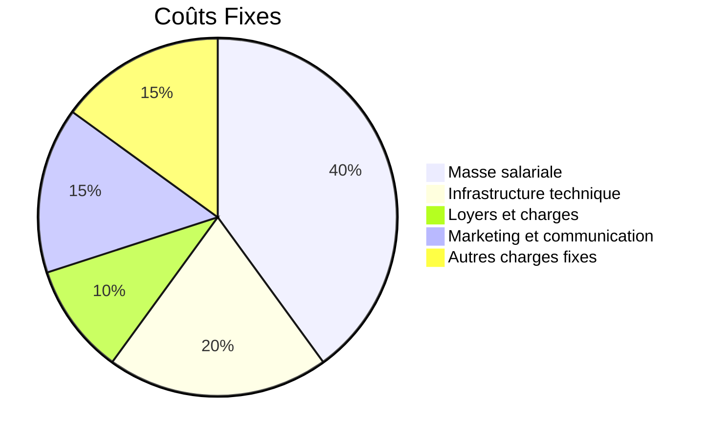
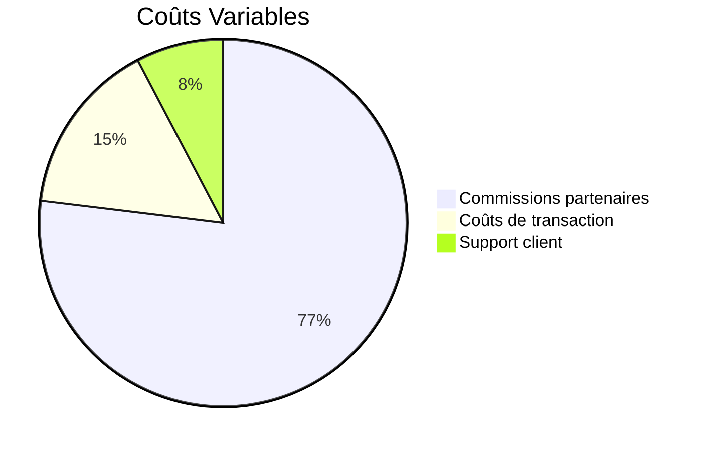
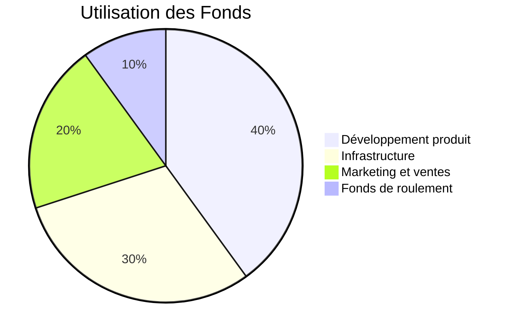

# Projections Financières LOMI AFRICA 2024-2026

## Table des Matières
1. [Hypothèses de Base](#1-hypothèses-de-base)
2. [Projections Détaillées](#2-projections-détaillées)
3. [Structure des Coûts](#3-structure-des-coûts)
4. [Investissements Prévus](#4-investissements-prévus) 
5. [Indicateurs de Performance](#5-indicateurs-de-performance)
6. [Plan de Financement](#6-plan-de-financement)

## 1. Hypothèses de Base

### Contexte Macroéconomique
La croissance du marché des paiements électroniques dans l'UEMOA est estimée à 30% par an, avec une pénétration croissante du mobile money et du e-commerce. En tant que startup innovante, LOMI AFRICA se positionne pour capturer une part significative de cette croissance.

### Hypothèses Opérationnelles
Nos projections reposent sur des hypothèses réalistes pour une startup fintech en phase de lancement :

| Hypothèse                      | Valeur   |
|--------------------------------|----------|
| Taux de conversion marchands   | 25%      |
| Taux de rétention annuel       | 85%      |
| Volume mensuel par marchand    | 15 M FCFA|
| Commission moyenne             | 1,2%     |
| Croissance mensuelle           | 8%       |

## 2. Projections Détaillées

### Année 1 (2024)

| Indicateur                | S1 2024         | S2 2024         | Total 2024 |
|---------------------------|-----------------|-----------------|------------|
| Nb marchands actifs       | 50 - 150        | 150 - 300       | 300        |
| Volume transactions (Mds) | 2,25 - 6,75     | 6,75 - 13,5     | 20,25      |
| Chiffre d'affaires (M)    | 27 - 81         | 81 - 162        | 243        |
| Charges opérationnelles   | (150)           | (180)           | (330)      |
| Résultat d'exploitation   | (123) - (69)    | (99) - (18)     | (87)       |

### Année 2 (2025)

| Indicateur                | S1 2025         | S2 2025         | Total 2025 |
|---------------------------|-----------------|-----------------|------------|
| Nb marchands actifs       | 300 - 500       | 500 - 800       | 800        |
| Volume transactions (Mds) | 13,5 - 22,5     | 22,5 - 36       | 58,5       |
| Chiffre d'affaires (M)    | 162 - 270       | 270 - 432       | 702        |
| Charges opérationnelles   | (200)           | (250)           | (450)      |
| Résultat d'exploitation   | (38) - 70       | 20 - 182        | 252        |

### Année 3 (2026)

| Indicateur                | S1 2026         | S2 2026         | Total 2026 |
|---------------------------|-----------------|-----------------|------------|
| Nb marchands actifs       | 800 - 1200      | 1200 - 1800     | 1800       |
| Volume transactions (Mds) | 36 - 54         | 54 - 81         | 135        |
| Chiffre d'affaires (M)    | 432 - 648       | 648 - 972       | 1620       |
| Charges opérationnelles   | (300)           | (400)           | (700)      |
| Résultat d'exploitation   | 132 - 348       | 248 - 572       | 920        |

### Évolution du Résultat Net
```mermaid
graph TD
    A[2024: (87) M FCFA] --> B[2025: 252 M FCFA]
    B --> C[2026: 920 M FCFA]
```

## 3. Structure des Coûts

### Répartition des Coûts Fixes


### Répartition des Coûts Variables


## 4. Investissements Prévus

| Poste                      | 2024    | 2025    | 2026    |
|----------------------------|---------|---------|---------|
| Développement plateforme   | 100     | 75      | 100     |
| Infrastructure technique   | 50      | 50      | 100     |
| Marketing et acquisition   | 50      | 75      | -       |
| Expansion régionale        | -       | -       | 100     |
| **Total (M FCFA)**         | **200** | **200** | **300** |

## 5. Indicateurs de Performance

### Métriques Financières

| Métrique       | 2024   | 2025   | 2026   |
|----------------|--------|--------|--------|
| Marge brute    | 35%    | 40%    | 45%    |
| EBITDA         | (30%)  | 10%    | 40%    |
| Point mort     | -      | Mois 18| -      |
| ROI            | -      | -      | 180%   |

### Métriques Opérationnelles

| Métrique                 | Objectif   |
|--------------------------|------------|
| Coût acquisition marchand| 500 K FCFA |
| Valeur vie client        | 2,5 M FCFA |
| Taux satisfaction client | > 90%      |
| Disponibilité système    | > 99,99%   |

## 6. Plan de Financement

### Sources de Financement

| Source           | Montant (M FCFA) |
|------------------|------------------|
| Capital social   | 100              |
| Autofinancement  | 50               |
| Dette bancaire   | 0                |
| **Total**        | **150**          |

### Utilisation des Fonds


Date de dernière mise à jour : [Date]

[Signatures autorisées]
